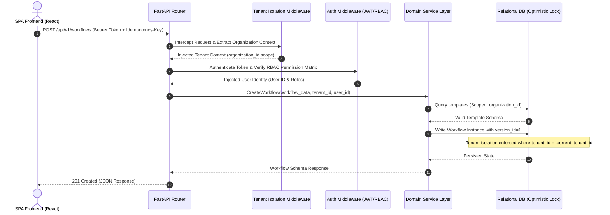
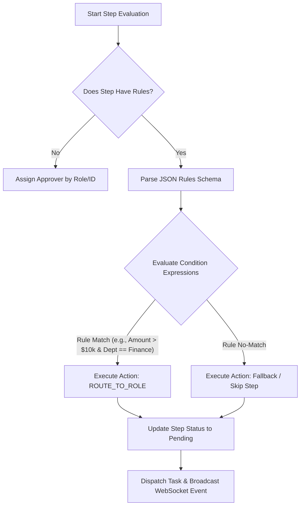

# SutraOps ⚡

> **Production-Grade, Multi-Tenant, Rule-Driven Enterprise Workflow Automation & Approval Platform**

[](https://www.python.org/)
[](https://fastapi.tiangolo.com/)
[](https://react.dev/)
[](https://www.typescriptlang.org/)
[](https://vitejs.dev/)
[](https://tailwindcss.com/)
[](LICENSE)

---

## 📖 Overview

**SutraOps** is a high-throughput, multi-tenant enterprise workflow automation and approval engine built to solve complex organizational governance, rule routing, and multi-stage decision trees.

Designed with an asynchronous microservices architecture, SutraOps combines real-time event distribution over WebSockets with strict database multi-tenancy, optimistic concurrency locking, and dynamic rule-evaluation engines.

---

## ✨ Key Features

- 🏢 **Strict Multi-Tenant Isolation**: Multi-tenancy enforced at the database repository layer via middleware context propagation (`organization_id`).
- ⚡ **Dynamic Rule Processing Engine**: Evaluates complex conditionals (e.g. `Amount > $10k & Dept == Finance`) to trigger actions like `ROUTE_TO_ROLE`, `AUTO_APPROVE`, or `SKIP_STEP`.
- 🔒 **Optimistic Concurrency Control (OCC)**: Version-id tracked entity state mutations (`version_id`) eliminating double-approval race conditions.
- 📡 **Real-Time WebSocket Synchronization**: Instant state propagation to connected clients on approval, rejection, or workflow escalation events.
- 🔄 **Idempotent Operations**: Built-in `Idempotency-Key` middleware preventing duplicate mutations on network retries.
- 📊 **Executive Analytics & Observability**: Real-time SLA tracking, step latency metrics, department workload distribution, and total throughput metrics.
- 🔐 **Fine-Grained RBAC**: Role-based permission guards (SuperAdmin, Admin, Manager, Employee) across API routes and UI components.
- 🎨 **Modern Dark UI**: Fluid, glassmorphic UI built with React 19, TypeScript, TailwindCSS v4, Zustand state management, and Lucide icons.

---

## 🏗️ System Architecture

### 1. Multi-Tenant Request Lifecycle & Isolation



### 2. Workflow Rule Processing Pipeline



---

## 🔐 Permission Matrix (RBAC)

| Role | Create Workflow | Approve Step | Manage Organization | View Analytics | Manage Templates |
| :--- | :---: | :---: | :---: | :---: | :---: |
| **SuperAdmin** | ✅ | ✅ | ✅ (All Tenants) | ✅ | ✅ |
| **Admin** | ✅ | ✅ | ✅ (Single Tenant) | ✅ | ✅ |
| **Manager** | ✅ | ✅ | ❌ | ✅ (Dept Scoped) | ❌ |
| **Employee** | ✅ | ❌ | ❌ | ❌ | ❌ |

---

## 🛠️ Tech Stack

### **Backend**
- **Framework**: Python 3.11+, FastAPI
- **ORM & Database**: SQLAlchemy (Async), PostgreSQL / SQLite
- **Validation**: Pydantic v2
- **Concurrency & Cache**: Redis, Optimistic Locking (`version_id`)
- **Task Queue**: Celery / Asynchronous EventBus
- **Real-Time**: WebSockets

### **Frontend**
- **Framework**: React 19, TypeScript
- **Build Tool**: Vite 8
- **Styling**: TailwindCSS v4, PostCSS
- **State Management**: Zustand
- **Icons**: Lucide React
- **HTTP Client**: Axios with intercepters

---

## 📂 Project Structure

```
SutraOps/
├── backend/
│   ├── app/
│   │   ├── core/           # Security, config, logging, websocket manager, event handlers
│   │   ├── middleware/     # Tenant isolation, idempotency, correlation ID, error handler
│   │   ├── models/         # SQLAlchemy ORM models (Tenant, User, Workflow, Approval)
│   │   ├── repositories/   # Tenant-scoped data repositories
│   │   ├── routers/        # Versioned API routes (/api/v1/...)
│   │   ├── schemas/        # Pydantic validation schemas
│   │   ├── services/       # Domain business logic & rules engine
│   │   └── main.py         # FastAPI application entrypoint & middleware setup
│   └── tests/              # Pytest suite (unit & integration tests)
├── frontend/
│   ├── src/
│   │   ├── components/     # Navbar, Sidebar, ProtectedRoute, UI components
│   │   ├── pages/          # Dashboard, Kanban, Login, Analytics, Templates, Admin
│   │   ├── services/       # Axios API client setup
│   │   ├── store/          # Zustand global store & WebSocket client
│   │   ├── App.tsx         # Route router layout
│   │   └── main.tsx        # React root entrypoint
│   ├── package.json
│   └── vite.config.ts
├── .gitignore
├── implementation_plan.md
├── LICENSE
└── README.md
```

---

## 🚀 Getting Started

### Prerequisites
- **Python**: `3.11` or higher
- **Node.js**: `18.0` or higher (with `npm` or `pnpm`)
- **Git**

---

### 1. Backend Setup

```bash
# Navigate to backend directory
cd backend

# Create virtual environment
python -m venv venv

# Activate virtual environment
# Windows:
venv\Scripts\activate
# macOS/Linux:
source venv/bin/activate

# Install dependencies
pip install -r requirements.txt

# Start FastAPI development server
uvicorn app.main:app --reload --port 8000
```

The API will be live at `http://localhost:8000`.  
Explore interactive OpenAPI docs at `http://localhost:8000/api/v1/openapi.json` or `http://localhost:8000/docs`.

---

### 2. Frontend Setup

```bash
# Navigate to frontend directory
cd frontend

# Install dependencies
npm install

# Start Vite development server
npm run dev
```

The UI dashboard will be accessible at `http://localhost:5173`.

---

## 🧪 Running Tests & Quality Verification

### Backend Tests
```bash
cd backend
pytest
```

### Frontend Build & Lint Check
```bash
cd frontend
npm run build
```

---

## 📡 API Endpoints Summary (`/api/v1`)

| Method | Endpoint | Description | Access |
| :--- | :--- | :--- | :--- |
| `POST` | `/api/v1/auth/login` | Authenticate user & issue JWT token | Public |
| `GET` | `/api/v1/auth/me` | Fetch active user profile & organization | Authenticated |
| `GET` | `/api/v1/workflows` | List multi-tenant workflow instances | Authenticated |
| `POST` | `/api/v1/workflows` | Create a new workflow instance | Employee+ |
| `POST` | `/api/v1/approvals/{id}/action` | Submit approval / rejection decision | Manager+ |
| `GET` | `/api/v1/templates` | Fetch blueprint workflow templates | Authenticated |
| `POST` | `/api/v1/templates` | Create workflow template blueprint | Admin+ |
| `GET` | `/api/v1/analytics/overview` | Real-time organization metrics | Manager+ |
| `WS` | `/ws/{organization_id}` | Live WebSocket notification channel | Authenticated |

---

## 📜 License

Distributed under the **MIT License**. See [`LICENSE`](LICENSE) for more details.

---

<p center="align">
Made with ❤️ by <a href="https://github.com/namitha2526">Namitha R</a>
</p>
