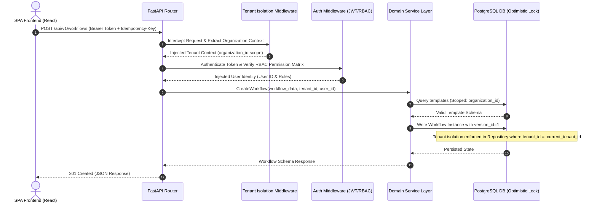

# NexusFlow - Master Implementation Plan (Enterprise Workflow Platform)

NexusFlow is a production-grade, multi-tenant, rule-driven enterprise workflow automation and approval platform. This blueprint defines its clean, scalable architecture, normalized relational database design, concurrency models, testing strategies, and sequential execution roadmap.

---

## Architectural & System Design Diagrams

### 1. Multi-Tenant Request Lifecycle, Auth, & Tenant Isolation Middleware



### 2. Workflow Rule Processing & Concurrency Pipeline

```mermaid
graph TD
    A[Start Step Evaluation] --> B{Does Step Have Rules?}
    B -- No --> C[Assign Approver by Role/ID]
    B -- Yes --> D[Parse JSON Rules Schema]
    D --> E{Evaluate Condition Expressions}
    
    E -- "Rule Match (e.g., Amount > $10k & Dept == Finance)" --> F[Execute Rule Action: Route to Director]
    E -- "Rule No-Match" --> G[Execute Fallback Action: Skip Step / Route Default]
    
    F --> H[Update Step Status to Pending]
    G --> H
    H --> I[Dispatch Task & Raise "task.assigned" Event]
```

---

## Permission Matrix & RBAC Design

NexusFlow enforces fine-grained access control at the service and API gateway layers. The following matrix governs authorization:

| Role | Create Workflow | Approve Step | Manage Organization | View Analytics | Manage Templates |
| :--- | :---: | :---: | :---: | :---: | :---: |
| **SuperAdmin** | Yes | Yes | Yes (All Tenants) | Yes | Yes |
| **Admin** | Yes | Yes | Yes (Single Tenant) | Yes | Yes |
| **Manager** | Yes | Yes | No | Yes (Department Scoped) | No |
| **Employee** | Yes | No | No | No | No |

---

## Concurrency Control, Idempotency, & Tenant Isolation

### 1. Concurrency Control (Optimistic Locking)
To prevent the classic double-approval problem (e.g., two managers clicking "Approve" at the exact same millisecond on a pending step), NexusFlow utilizes **Optimistic Concurrency Control (OCC)**. 
* All major state entities (Workflows, Approvals) incorporate a `version_id` column.
* SQLAlchemy dynamically handles this via:
  ```python
  class Workflow(Base):
      __tablename__ = "workflows"
      id = Column(UUID(as_uuid=True), primary_key=True, default=uuid.uuid4)
      version_id = Column(Integer, nullable=False, default=1)
      __mapper_args__ = {
          "version_id_col": version_id
      }
  ```
* If a concurrent transaction attempts to write an approval using a stale `version_id`, SQLAlchemy raises a `StaleDataError` causing the second transaction to abort safely, returning a clean HTTP `409 Conflict` client warning.

### 2. Idempotency Protection
* Critical mutating actions (e.g., initiating a workflow, submitting an approval, uploading a file) support an optional `Idempotency-Key` header.
* A FastAPI middleware checks this key against Redis cache.
* If a key is present and currently processing, subsequent requests block or receive a cached version of the original response, preventing duplicate records.

### 3. Tenant Isolation Middleware
* Soft multi-tenancy is strictly isolated at the database level.
* **Middleware Capture**: The custom `TenantIsolationMiddleware` intercepts requests, parses the `X-Organization-ID` header or custom JWT claim, and sets a contextual context variable using standard `contextvars`.
* **Repository Scope Enforcement**: The base repository class automatically injects `.filter(self.model.organization_id == tenant_id)` on all queries, guaranteeing that SQL expressions are never compiled without tenant boundaries.

### 4. API Versioning
* All REST endpoints strictly implement standard enterprise semantic path versioning:
  `/api/v1/...` (e.g. `/api/v1/auth/login`, `/api/v1/workflows`)

---

## Event-Driven Architecture (EDA) & Event Failure Recovery

NexusFlow uses an internal, asynchronous event loop to trigger secondary routines (notifications, email queuing, audit logging, escalation monitors).

### Event Structure:
* Type: `Event(event_type: str, payload: dict, organization_id: UUID, correlation_id: str)`
* Valid standard events:
  * `workflow.created`
  * `approval.completed`
  * `task.assigned`
  * `notification.triggered`

### Failure & Retry Policies:
* When an event listener fails, the subscriber executes an **Exponential Backoff Retry** policy:
  * Initial delay: 1s, doubling up to a maximum of 3 retries.
* If all retries fail, the event is serialized and persisted to the `dead_letter_logs` database table (Dead-Letter Queue logic), allowing developers to review, debug, and manually replay actions.

---

## Database Architecture (Normalized PostgreSQL)

```mermaid
erDiagram
    ORGANIZATION ||--o{ DEPARTMENT : contains
    ORGANIZATION ||--o{ USER : owns
    ORGANIZATION ||--o{ WORKFLOW_TEMPLATE : publishes
    ORGANIZATION ||--o{ WORKFLOW : hosts
    ORGANIZATION ||--o{ AUDIT_LOG : tracks
    
    DEPARTMENT ||--o{ USER : manages
    
    USER ||--o{ APPROVAL : actioner
    USER ||--o{ COMMENT : writes
    USER ||--o{ ATTACHMENT : uploads
    USER ||--o{ NOTIFICATION : target
    
    WORKFLOW ||--o{ WORKFLOW_STEP : "has sequences"
    WORKFLOW ||--o{ APPROVAL : "collects"
    WORKFLOW ||--o{ TASK : "generates"
    WORKFLOW ||--o{ COMMENT : "discusses"
    WORKFLOW ||--o{ ATTACHMENT : "retains"
    
    WORKFLOW_STEP ||--o{ APPROVAL : "triggers"
    
    ORGANIZATION {
        uuid id PK
        string name
        string domain UNIQUE
        boolean is_active
        datetime created_at
    }
    
    DEPARTMENT {
        uuid id PK
        uuid organization_id FK
        string name
        string code
        datetime created_at
    }
    
    USER {
        uuid id PK
        uuid organization_id FK
        uuid department_id FK "nullable"
        string email UNIQUE
        string hashed_password
        string full_name
        string role "SuperAdmin, Admin, Manager, Employee"
        boolean is_active
        datetime created_at
    }
    
    WORKFLOW_TEMPLATE {
        uuid id PK
        uuid organization_id FK "nullable"
        string name
        string description
        string category "Procurement, HR, IT, Compliance"
        jsonb structure "preconfigured steps, actions and conditions"
        boolean is_active
        datetime created_at
    }
    
    WORKFLOW {
        uuid id PK
        uuid organization_id FK
        uuid creator_id FK
        uuid template_id FK "nullable"
        string title
        string description
        string status "Draft, Pending, Approved, Rejected, Escalated"
        uuid current_step_id FK "nullable"
        integer version_id "Optimistic Concurrency Lock"
        datetime created_at
        datetime updated_at
    }
    
    WORKFLOW_STEP {
        uuid id PK
        uuid workflow_id FK
        string name
        integer step_order
        string approver_role "SuperAdmin, Admin, Manager, Employee"
        uuid approver_id FK "nullable"
        jsonb rule_definition "JSON condition schemas"
        datetime created_at
    }
    
    APPROVAL {
        uuid id PK
        uuid workflow_id FK
        uuid step_id FK
        uuid approver_id FK
        string status "Pending, Approved, Rejected"
        string comments
        datetime SLA_deadline
        datetime actioned_at "nullable"
    }
    
    TASK {
        uuid id PK
        uuid workflow_id FK
        string title
        string description
        string status "Todo, InProgress, InReview, Done"
        string priority "Low, Medium, High, Urgent"
        uuid assignee_id FK
        datetime deadline
        datetime created_at
    }
```

---

## Detailed MVP Scope vs. Post-MVP Scope

### Core MVP Deliverables (Phase 1 to Phase 3)
1. **Core Database Setup**: Multi-Tenant Schema via SQLAlchemy + Alembic, supporting production-ready PostgreSQL.
2. **Tenant Isolation Middleware**: Middleware extracting tenant headers, setting context variables, and Repository-level query isolation checks.
3. **Optimistic Locking & Idempotency Checkers**: SQLAlchemy mapper configs and unique check algorithms.
4. **Auth & Security Stack**: JWT tokens, RBAC permission checker matching the Permission Matrix, API versioning wrapper `/api/v1`.
5. **Workflow Rules Engine**: Engine parsing dynamic condition predicates (attributes, departments) to resolve routing.
6. **Workflows & Blueprint Templates Marketplace**: Standardized templates engine to let organizations import/export workflow blueprints.
7. **Observability Stack**: JSON-based logging, health endpoints, correlation tracing, and complete Swagger/ReDoc.
8. **Heavy Seed Script**: Dynamic database populator simulating multi-department structures.

### Advanced Capabilities (Phase 4 & Phase 5)
1. **Background queues & Reminders**: Celery tasks checking SLAs and dispatching emails.
2. **WebSockets Server**: Broadcaster framework mapping state updates.
3. **Redis Caching**: Performance caching of analytical calculations.
4. **Complex SLA Analytics**: Dashboard telemetry computing SLA breaches, approval latency metrics, and the custom **Workflow Efficiency Score**:
   $$\text{Workflow Efficiency Score} = \frac{\text{Completed On Time} + (0.5 \times \text{Early Actions})}{\text{Total Workflow Actions}} \times 100$$
5. **Admin Feature Flags**: Metadata toggles controlling feature modularity.

---

## Testing Strategy

To validate core business logic, the testing suite focuses heavily on boundaries and state mechanics:

### 1. Unit Tests
* **Rules Engine Validation**: Test predicate schemas (e.g. testing combinations of dynamic criteria variables against rules engine parsing logic).
* **Idempotency checks**: Verify dynamic caching blocks duplication keys.

### 2. Integration Tests
* **Tenant Isolation Verification**: Insert documents for Tenant A, attempt to query/fetch using Tenant B's credentials, verifying that the dynamic isolation middleware blocks leaking data.
* **RBAC Constraints**: Attempt to access analytics endpoints using Employee context and confirm dynamic HTTP `403 Forbidden` response.
* **Double-Approval Concurrency Checks**: Simulating concurrent execution threads attempting to approve a single step simultaneously, asserting that only the first thread succeeds while the second fails with a `409 Conflict` mismatch due to optimistic lock versions.

---

## Realistic Execution Roadmap

Rather than optimistic daily estimates, the roadmap is staged by rigorous engineering blocks:

* **Block 1: Database & Foundation Layer**: Model construction, migrations, multi-tenant resolution and structured logging context middlewares.
* **Block 2: Authentication & Authorization Modules**: JWT lifecycle, refresh endpoints, and role validation permission matrix.
* **Block 3: Domain Business Logic**: Dynamic JSON rules engine engine, blueprints parser, and internal Event Bus handlers with retries.
* **Block 4: Front-End Core & Workspace Layouts**: Unified api.ts Axios interceptor client, custom UI controls, and reactive global Zustand stores.
* **Block 5: Rich Interactive Features**: Workspace Builder canvas, Task Kanban boards, SLA Analytics displays, and docker setups.
